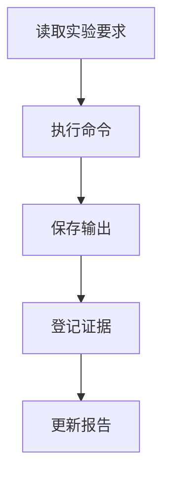

# Mermaid 图表生成与校验 Skill

## 触发条件

当需要生成或检查以下图表时触发：

- 实验流程图；
- 结构体内存布局图；
- 栈帧结构图；
- 攻击字符串布局图；
- 函数调用图；
- ELF 编译链接流程图；
- 符号表与重定位关系图。

## 必须读取

1. `experiments/<lab>/notes/*.md`
2. `experiments/<lab>/outputs/*.txt`
3. `experiments/<lab>/evidence/evidence_manifest.md`
4. `templates/diagrams/*.mmd`
5. `docs/figure_and_table_rules.md`

## 输出目录

源文件：

```text
experiments/<lab>/diagrams/source/*.mmd
```

渲染文件：

```text
experiments/<lab>/diagrams/rendered/*.png
```

报告引用文件：

```text
report/figures/
```

## 图表规则

1. 每张图必须有明确标题和用途。
2. 每张图必须能对应一个实验步骤或证据编号。
3. 栈帧图必须和 GDB 输出的地址或偏移对应。
4. ELF 图必须和 `readelf` / `objdump` 输出对应。
5. 图表源文件必须保留，不能只保留 PNG。
6. 不确定的地址、偏移、符号不得写死，应标为“待由实验输出补充”。

## Mermaid 模板示例



## 禁止事项

- 不得为了美观伪造实验步骤。
- 不得把未执行的命令画入流程图。
- 不得生成无法渲染的 Mermaid 语法。
- 不得只输出图片而不保存 `.mmd` 源码。

## 检查标准

- `.mmd` 文件可读；
- 图中节点名称简洁；
- 图与报告正文一致；
- 图题、图号和正文引用一致。
